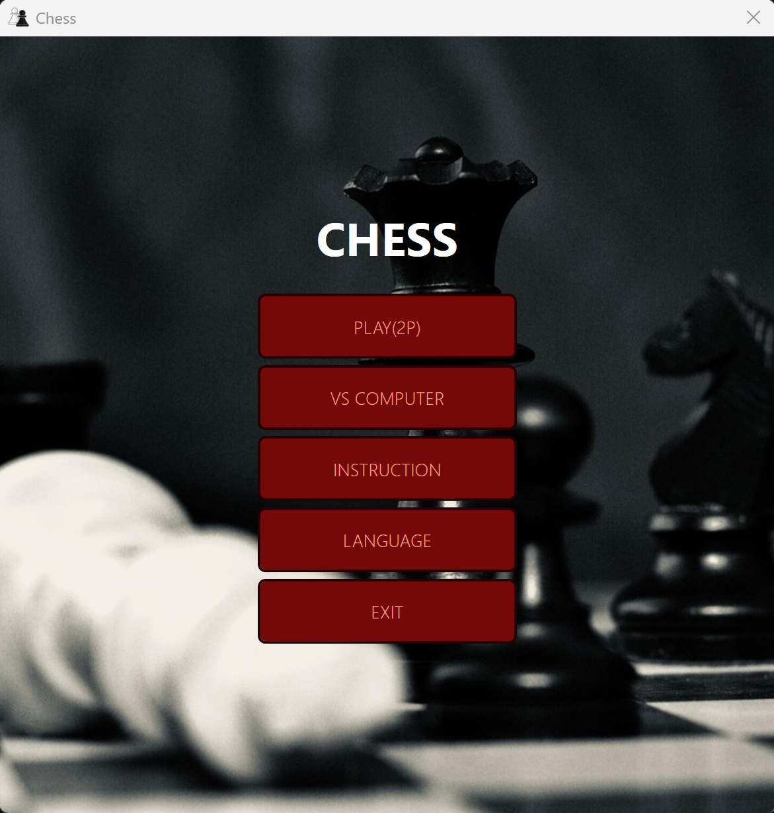
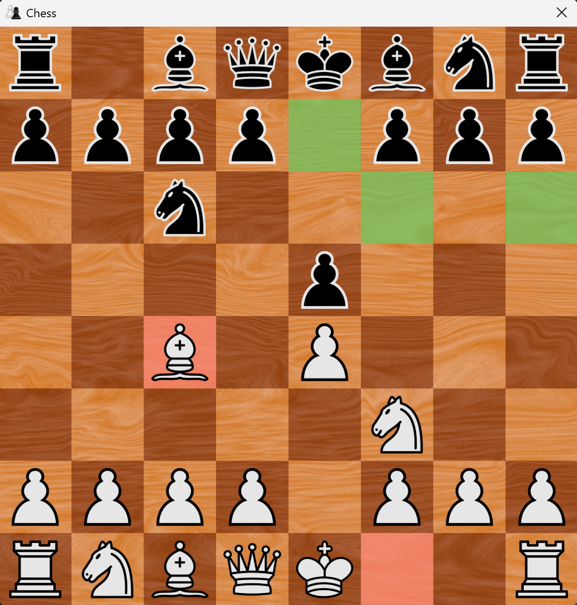
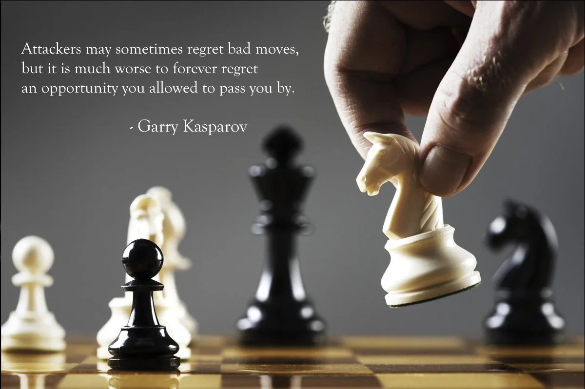

# Chess Game

### Overview

A chess game developed in C# using Visual Studio 2022

### Features

- <strong>Supports local PvP mode and integrates the Stockfish engine to provide PvE mode  
- When it's White's / Black's turn, the mouse cursor color will switch to white / black accordingly
- Sound effects for move, capture, castling, check, promotion and game over 
- Implements legal move highlighting and markers for original and destination positions
- Supports English, Chinese and Russian languages</strong>

### Screenshots

 

  
   
  <em><strong>Main Menu</strong></em>
    
  
   
  <em><strong>In Game</strong></em>
   

  

#### Give it a try now! 👉: [Download](https://github.com/LCZ-ctrl/Chess_Game/releases)
  

  

